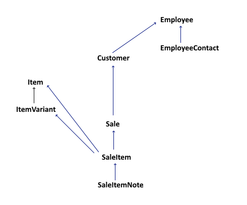
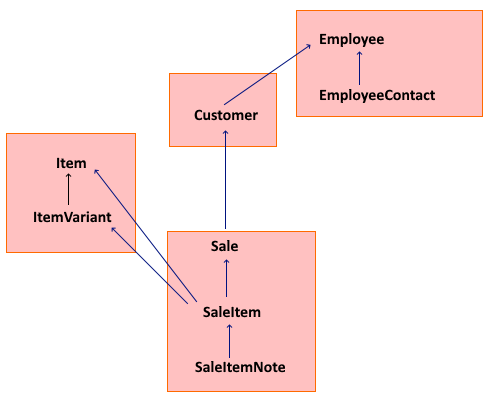
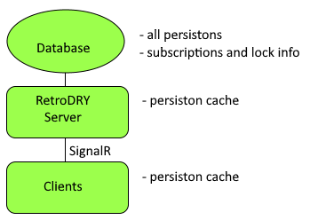
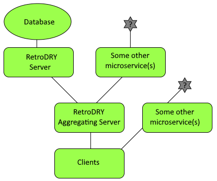

[docs index](../README.md) > Introduction to RetroDRY

Overview
========

What it is
----------

-   RetroDRY is a multi-tier multi-language framework for handling these common aspects of database application development:

    -   Loading and saving data
    -   Replication across tiers
    -   Change subscriptions, locks, and dirty-detection across tiers
    -   User editing
-   We define "database applications" to be almost anything, but the core audience for the framework is business web applications that deal with large numbers of record types (clients, vendors, inventory, and so on). RetroDRY is used in the microservice tiers and the client tier.
-   The framework is defined by API semantics, meaning the code on either side can change, but the the URL endpoints and format of data going across the wire is what defines RetroDRY. However the only languages supported initially are C\# back end and javascript client side, with visual components in React.
-   It can also handle these scenarios:

    -   Multi-tier distributed microservice environments where a UI might compose multiple data services.
    -   Scaled systems with partitioned databases and many application servers.
    -   Multiple natural languages.
    -   Custom columns defined at runtime.

What it is not
--------------

-   The framework is not a complete application template, since it does not include any client side navigation or CSS styles, and does not require any specific database or schema.
-   It is an Object-Relational Model (ORM)? Yes and no.

    -   It helps you load and save data like any ORM.
    -   It cuts way down on the number of lines of code you have to write, compared to using no ORM framework at all.
    -   It does not autogenerate databases, does not issue create table or alter table commands, and does not autogenerate source code for you.
    -   It does not provide arbitrary SQL generation via source code as done with LINQ in Entity Framework. (You could still use that in conjuction with RetroDRY though.)

Why did we make this?
---------------------

-   The framework is called RetroDRY because:

    -   "Retro" indicates going back to the old systems that supported centralized data dictionary and automated editing (like FoxPro and Visual Basic)
    -   "DRY" means "Don't repeat yourself".
-   Database editing apps can be really repetitive to write these days, so to take DRY to the next level, here's what drops out of your code base:

    -   Defining API REST endpoints for GET, PUT, POST of each data type.
    -   Coding the load and save behavior of each type separately.
    -   Defining the wire types expected by and returned by the API endpoints.
    -   Mapping between database entity classes and wire classes.
    -   Duplicating the entity classes on the client side.
    -   Duplicating the natural language labels and validation rules on the client side.
    -   Coding the search/results grid.
    -   Coding the entry form.
    -   After editing a record, reloading or updating the list of customers to reflect the change.

An opinionated framework
------------------------

A framework is said to be "opinionated" if it forces you to work around its ways, or "unopinionated" if you can use parts of it with other frameworks. RetroDRY is a bit in the middle of that distinction.

It's unopinionated about structuring UX, and about appearance. It does not include an application entry point so you can use any web server. On the other hand, it is not a light add-in that you can use for just a few places in your code. If you use it, you should commit to using the whole system.

RetroDRY is opinionated about these things in particular:

-   Databases should mostly be relational (rather than schemaless) because you can plan for and optimize indexes and stored procedures; you can force integrity; you can control access at a detailed level within your organization; and you can connect a reporting app to the database more cleanly.
-   Generic handling of data sets is important, because we should not have to write the same code over and over to handle each type, and because this facilitates custom columns not known at design time.
-   Persistence should be in well-defined units that are often larger than one table row. (The term "entity"' is avoided here beause it is often assumed to mean a single row.) As an example, a customer row with its child contact rows should be loaded, cached, edited and communicated as a unit throughout all layers of an application. Those units (persistons) should be the way we think about the application on the business side, for users, and for developers.
-   We side with "data first" approaches (instead of "code first") because databases last longer than code, and they should be documented separately. Your code should never put things in a database that are not human readable unless they are clearly documented in a way that can be produced and parsed in any language. So for example if you have a mechanism to serialize some C\# class and dump that into a database field, then you've created a dependency from the datbase into your code implementation, which is backwards.
-   User edits should not collide, and locking should be managed and pessimistic, at least when it comes to the main user-facing business data like customers and sales. So, if one user is editing something (a customer, say) then another user should not be able to even start editing that same customer. This avoids a lot of problems, most notably the consistency you get when you can validate customer objects as a whole.

Should I use it?
----------------

Here are some of the main points of evaluation to consider:

-   **Number of tables.** If your application only deals with a few tables, then the cost of hand-coding load/save functions, API endpoints, and editing forms for those tables is not that great, so RetroDRY could cost a lot of learning time for little benefit. However, if your application has 10 or 100s of tables, then the time spent learning RetroDRY is worth the savings of thousands of lines of code.
-   **Legacy database?** If your existing database has a lot of features that are not compatible with RetroDRY, it might not be worth it because of having to write code to handle each of those cases. The main one is if tables have multi-column primary keys.

Data theory
===========

This section explains some database design points and how RetroDRY thinks about data.

Definitions
-----------

-   A "persiston" is the unit of persistence, such as a customer or order. It may have any number of rows from any number of tables. The database should consist of discrete persistons that do not overlap; in other words a row may not be part of more than one persiston. Persistons are loaded and saved and communicated as a whole. Main kinds of persistons are:

    -   *Whole table* - For example a lookup table is edited as a whole, so it is one persiston.
    -   *Single main row* - For example a sale always has exactly one row in the sale table; it may also have zero or more rows in other child tables (such as line items). This kind of persiston distinguishes between new and existing flavors, and uses the main row's key as its persiston key.
    -   *Multiple children* - For example a persiston defined as "all supporting documents for a single customer" uses the customer key as its key, but it might have no rows. Even when it has no rows, it is still defined to exist if the customer exists. This typs is less common.
-   Foreign keys can point to either the main row of a "single main row" persiston, or to a row within a "whole table" persiston. These two ways are the same in the data model, and are only distinguished in the data dictionary.
-   A "viewon" is the unit of non-persistable views, meaning the result of an arbitrary SQL load that might join across various persistons and include parts of many persistons. The structure is normally equivalent to "multiple children" but they can be single-main-row as well.
-   A "daton" is any unit of data, and is the parent class comprising persistons and viewons. Datons define tables and columns, have a data dictionary, and can be loaded from a database.
-   Every daton has a main table and optional child tables. (It cannot have more than one main table.) Any daton having multiple tables must define them as a strict acyclic directed graph of parent-child relationships without multiple parentage. If your data structure has internal foreign keys that don't fit into this structure, those other keys can still be present but they are not considered by RetroDRY for structuring data sets.

Sample data model
-----------------

-   This demonstration data model contains a lot of the features common to business apps like master-detail and lookup tables. We're using it to demonstrate how to think about data the RetroDRY way.
-   Lookup tables (not shown in diagrams)

    -   PhoneType
    -   SaleStatus

-   Main table diagram, below, shows a couple common considerations:

    -   Foreign keys are listed pointing to the parent table from the table holding the reference.
    -   There can be more than one note per line item on a sale, and we assume the UI requirement is for two levels of master-detail on an entry form.
    -   The foreign key from SaleItem to Item may appear redundant, and in the wild, many databases have imperfect normalization (sometimes for good reasons, sometimes mistakes). In this case, the SaleItem's variant is optional because many items do not have any variants.

-   While the structure pictured above is fine for traditional data modeling, for RetroDRY we also need to design the persistons as follows:

    -   Each lookup table is a whole-table persiston.
    -   There are four business persiston types, each of which is a single-main-row style:

        -   Item, which contains the variants of each item
        -   Customer
        -   Employee, wich contains the contact records for the employee
        -   Sale, which contains the line items and notes
    -   Each persiston is noted as a shaded box. Consider that when a sale is loaded, all its line items are loaded too - this is reasonable because each sale will have a reasonable number of items. On the other hand, loading sales when you load the customer is unreasonable, so they are designed as separate persistons. It might be reasonable to consider Item as a "lookup table" meaning it is small and loaded as a unit (a whole-table persiston) but perhaps this hypothetical company has thousands of frequently changing items, so it's more reasonable to load them each as separate persistons.

The "big idea"
--------------

The big idea from the data model above is that **each value in the database is a member of exactly one persiston.** This rule is the basis for ensuring data integrity at the semantic level. To understand why, consider this scenario that leads to a data integrity violation: One user is in the process of updating a customer's address since they moved to a new state, and simultaneously another user is updating that customer's tax status, which is stored in a different table. If both edits are accepted, the result would be irrational.

In the RetroDRY philosophy, the customer is a persiston containing multiple rows and the persiston is versioned and locked, and is validated as a whole. So the user who first gets the lock can save changes (say, updated the address). The other user has a lock conflict (even though they are editing a different table) and their cached version is out of date. They have to get the new saved version then apply the tax change and validate. Validation will fail at that point, preventing the problem.

Many-to-many scenarios
----------------------

RetroDRY favors parent-child table relationships, but sometimes a table has two parents, or is a many-to-many join table. For example, suppose you have an Emp table of employees, a Role table of job roles, and an EmpRole table that is a many-to-many join between employees and roles.

To be compliant with the "big idea", the EmpRole table has to be either part of the Emp persiston or the Role persiston but not both. The user experience should ideally follow the way that the model makes the most sense. If there are potentially 10-100 different roles, and potentially thousands of employees, then:

-   Editing an employee's role assignments while editing the employee makes sense because that employee will only have a few roles at most. The Emp persiston will be small and code that needs to know the role assingments will have it by loading the Emp. Also the validation makes more sense (in case an employee may not have certain roles based on their department). This technique is probably preferred due to the table sizes and validation.
-   Editing the list of employees in a role while editing that role could be a workflow that is useful, but the Role persiston could get large and it would mean that the related employee names are loaded every time a role is loaded.
-   Regardless of which way around the persisons are defined, you can always use viewons to display read-only data any way you want.
-   If you include the EmpRole table in the Emp persison, you could still include a feature to add/remove employees to a role to mimic the "backwards" flow, and the feature implementation would fetch, modify and save each affected Emp persison. This way the "big idea" is followed and Emp persisons are validated.
-   It is also possible to design the Role persiston as a whole-table persiston that only includes the Role table, and separately define the EmpRole persison as "all employees assigned to one role". You might do this if data sets are very large and you want to optimize load and cache performance.

High level walkthough
=====================

-   Here's a walkthrough of steps for coding the experience for displaying and editing customers.
-   Start with a blank template for a server API in C\#, and a template for a React web application. The plumbing for hooking up the client to the server is not part of the framework, so you will have to at least create a login, menu and a hello-world API endpoint, with a client side behavior to access and test that endpoint. This is the starting point for adding RetroDRY.
-   Server steps:

    -   Define the customer data dictionary (also called the schema or metadata) for the customer persiston. The data dictionary includes the table and colum names, natural language labels, validation rules, and relationships between tables. The customer could have a child table of contacts, allowing any number of contacts per customer. It can also have custom columns defined at runtimme.
    -   Either accept the default loading/saving behavior, which the framework can determine from your data dictionary, or override the behavior if needed. This completes the ability to load and save individual customers.
    -   Define the data dictionary for loading *lists* of customers, also called the viewon. Viewons usually inherit many of the same columns as defined in the related persiston, but usually have fewer columns. This step includes defining the critieria that you want to allow searching by (such as name, region, or last sale date). Again, accept default load/save behavior or override it.
    -   Declare security roles and users (either hardcoded or loaded from a database) which allow a particular user to view and/or edit customers.
-   Client side steps:

    -   Define client-side layouts for display and editing of the customer persiston and customer viewon. The layouts are defined by ordering and grouping entry columns, with size-responsive indications (for example 2 groups could be shown side by side on large screens).
    -   Include boilerplate initialization code.
    -   Include the customer list viewon in a React component. This line of code gives the user the ability to search for customers by any of the criteria you defined earlier, as well as add, edit and delete customers.

        -   Code: `&lt;RetroStack seed="CustomerList|+" /&gt;`

-   If you want to manage your persistons programmatically instead of via user forms, then you can do this in javascript:

    const customer = await retrodry.get('customer:123');
    customer.region = 'West';
    await retrodry.save(customer);

-   This last sample shows how you can think of having access to the database server in client code, but in reality is is going through your app server, with caching, validation and permissions. Only the changed columns get sent back to the server.

Deployment Architecture
=======================

Simplest deployment
-------------------

In the simplest case the components are:

-   Single relational database: This stores all persistons and remembers which clients are subsribed to or editing which persistons.
-   External image storage (optional, not shown in diagram)
-   Single RetroDRY data server: This caches some persistons. In the initial version, this is limited to a C\# web server running under IIS or any other supported platform for NET Core. It does not support "serverless" (such as AWS Lambda functions) because clients need to always connect to the same server for the duration of their session.
-   Communication channel: This is implemented over long-polling http to support real time communication from server to client.
-   Web clients: Clients can also cache.

    -   Loading of the "static assets" (html, css, images etc) can be from the same domain, or you can set up the server for CORS and use a separate domain.

Deployment options for scaling performance
------------------------------------------

### Multiple RetroDRY servers

-   The first scaling you would probably do is to set up more than one server instance, both talking to the same database. The reason to do this first is because the server tier is often more of the bottleneck than the database. This almost works out of the box since the servers don't keep anything critical in memory.
-   However, unlike some typical setups where you use load balancing and the servers all answer on the same IP address, with RetroDRY you need to ensure the connection is "sticky" (that the client always talks to the same server). The easy way to do this is to give the server instances different domian names (such as: api1.example.com, api2.example.com, etc) and then provide the list of available servers in a JSON file available as part of the static assets when the client is loaded, or hard coded in the initialization javascript. Then the client will select one at random to talk to for its lifetime.
-   To cleanly un-deploy a server, remove its domain name so that new clients don't connect to it, and wait until it has no sessions remaining.
-   If the server fails or reboots, the client reconnects to a new one, but this starts a new session and has some consequences. Any locks that were in place for a persison that was being user edited will be lost and the user will need to wait two minutes to re-acquire the lock, and then start their edits again.

### Multiple databases

-   After multiple RetroDRY servers are established, and you still need better performance, the bottleneck might become the database server. In that case you can move some data to different databases, and each RetroDRY server talks to all the databases.
-   RetroDRY supports this scenario, but it still needs to be programmed. The recommended first approach to divide out data is to place the user table, permission tables, and subscription/lock tables in a separate database, and leave the business data all together in the original database. The users, permissions, and locks might account for roughly half the total database calls, but they are lightweight cals. It's usually more acceptable to users if loads of business data are a bit slower.
-   You can continue this process by splitting some business data into a separate database (for example sales transactions in its own database). This is supported easily by setting the DatabaseNumber in the daton definition.
-   The next potential level of scaling is partitioning which involves multiple databases having different rows and/or columns of the same logical data. This type of scaling would mean that one daton could be loaded from more than one database and combined. This is not easily supported by RetroDRY, but you could still do this by overriding all of the save and load methods for each daton type.

Deployment options for aggregation
----------------------------------
-   Warning: As of 2020-June, aggregating architecture support has not been coded.

-   In some enterprise environments there are many smaller microservices, say for different areas of business data or because they were developed in different eras, but the clients still need to show data from multiple places. In these cases you can build aggregating servers that wrap or combine data from multiple sources into RetroDRY persistons.

-   In this diagram, the aggregating server can define a new persiston type that isn't known to the top level RetroDRY server, and the client can treat it as if it is a coherent thing without knowing that it was actually stored in separate systems.
-   Alternately the client can be non-RetroDRY-aware and use a typical REST API. This would be a good choice if the client had already been built and the aggregating server would therefore need to be backwards-compatible with the API dialect of its predecessor.
